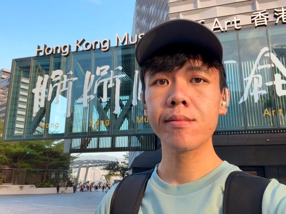

<!--
  =====================================================================
  THIS ONE FILE HOLDS ALL THE CONTENT OF THE WEBSITE.

  After editing, run this in the site folder to rebuild the pages:

      python3 build.py

  How it works:
  - Every "# Heading" (a single #) becomes a TAB in the navigation,
    and gets its own real page: "# Research" -> /research/.
    The FIRST tab becomes the homepage at /.
  - A line like "<!-- description: ... -->" just under a "# Heading"
    sets that page's one-line summary in Google results. Optional;
    without it the first paragraph is used.
  - EXCEPT "# Profile", which is special: it fills the sidebar shown
    on every tab (photo, name, tagline, contact links). In it, links
    get an icon based on where they point (mailto → envelope,
    scholar/orcid/github recognised by URL, files/ → download).
  - "## Heading" is a section heading inside a tab.
  - "### Heading" is a smaller sub-heading (project titles, years).
  - Quote blocks (lines starting with ">") render as bordered cards —
    use them for publications and talks.
  - Any link pointing into files/ renders as a download button.
  - Standard Markdown works everywhere: **bold**, *italic*,
    [link](url), bullet lists, and inline HTML if you need it.
  - This comment block is invisible on the site.
  =====================================================================
-->

# Profile

**Tommy YC WONG**
**黃昱翔**

- [mailto:]wongyc.tommy@gmail.com
- [ORCID](https://orcid.org/0009-0008-2769-3536)
- [Research Gate](https://www.researchgate.net/profile/Tommy-Wong-18?ev=hdr_xprf)
- [Download CV](files/wong-cv.pdf)
# About

<!-- description: Tommy YC Wong (黃昱翔) is a PhD student in linguistics at Hong Kong Baptist University, working on the linguistics–ethics interface, eye-tracking, prosody, and orthography. -->

Welcome to my site! 

I study what kind of cognitive system allows people to make moral judgments the way we do. Currently, I am doing a PhD in linguistics, supervised by [Prof. Lian-Hee WEE](https://eng.hkbu.edu.hk/en/people/academic-staff/wee-lian-hee.html) at Hong Kong Baptist University. My dissertation project explores whether grammatical frameworks adequately explain how people make moral judgments. My wider interests include eye-tracking, prosody, and orthography.

I completed an M.A. in Philosophy at the Chinese University of Hong Kong (2022). I edit a student-led journal [*FLaP FIRST: Journal for Formal Linguistics and Philosophy*](https://flapfirstjournal.wordpress.com/) (ISSN: 3105-6415). I am an Associate Fellow of AdvanceHE (AFHEA).

## News

- **May 2026** — Abstract accepted by a linguistics conference [EACL-13](https://eacl-13.sciencesconf.org/). Abstract: *Principled Variations in Lyrics Segmentation* [PDF](files/eacl-abstract.pdf)
- **May 2026** — Published *FLaP FIRST* Vol. 2 (editor-in-chief) — [read online](https://flapfirstjournal.wordpress.com/issues/)
- **Mar 2026** — Achieved the status of Associate Fellow at [AdvanceHE](https://advance-he.ac.uk/)
- **Feb 2026** — Completed qualifying exam. Manuscript: *Ocular Signature of Harm-related Moral Judgments*  — [PDF](files/crp-20260114.pdf)
- **May 2025** — Published *FLaP FIRST*  Vol. 1 — [read online](https://flapfirstjournal.wordpress.com/issues/)

# Research

<!-- description: Research projects on the grammatical system of ethical behaviour, eye movements in moral judgment, and lyric segmentation in Cantonese music video subtitling. -->

### The Grammatical System of Ethical Behaviours

*Linguistics–ethics interface · Moral language*

My PhD research. [Placeholder — describe the project in 3–5 sentences: the central research question, your approach, and what is at stake.]

### Eye Movements in Moral Judgments

*Eye-tracking · Moral cognition*

An eye-tracking experiment (*N* = 30) shows that harm-related moral judgments carry a distinctive ocular signature — increased pupil diameter and faster orienting towards the self-avatar — emerging within seconds of deliberation. See the manuscript *Ocular Signature of Harm-related Moral Judgments* [pdf](files/crp-20260114.pdf). I am currently designing stimuli for a follow-up study comparing eye movement patterns of moral and grammatical judgments.

### Lyric Segmentation in Music Video Subtitling

*Prosody · Syntax–music interface · Cantonese*

In music video subtitling, spatial breaks segment Chinese lyric lines at preferred positions. This project uncovers the grammatical principles governing the interface between visual presentation, syntax, and musical prosody in Cantonese songs — promising insight into Cantonese prosody where evidence from tone sandhi is lacking. To be presented at EACL-13 (Paris, September 2026) — [Abstract](files/eacl-abstract.pdf).

# Publications

<!-- description: Articles, manuscripts, edited journal issues and reviews by Tommy YC Wong, including work on moral judgment, eye-tracking, and Chinese orthography. -->

## Articles & Manuscripts

> **Ocular Signature of Harm-related Moral Judgments**
> **Wong, Tommy Y.C.** (2026)
> Manuscript (qualifying exam paper), Hong Kong Baptist University
> [PDF](files/crp-20260114.pdf)

> **Creative Adaptations of Chinese Orthography**
> Wee, Lian-Hee & **Wong, Tommy Y.C.** (2025)
> *ThinkChina*
> [Read online](https://www.thinkchina.sg/culture/creative-adaptations-chinese-orthography)

## Edited Journal Issues

> ***FLaP FIRST: Journal for Formal Linguistics and Philosophy*, volume 2**
> **Wong, Tommy Y.C.**, Zhixing Mei, Yoyo P.Y. Tsang, & Nuo Xu (eds.) (2026)
> [read online](https://flapfirstjournal.wordpress.com/issues/) [DOI](https://doi.org/10.5281/zenodo.20130405)

> ***FLaP FIRST: Journal for Formal Linguistics and Philosophy*, volume 1**
> Zhao, Kaixin, Yoyo P.Y. Tsang, & **Wong, Tommy Y.C.** (eds.) (2025)
> [read online](https://flapfirstjournal.wordpress.com/issues/) [DOI](https://doi.org/10.5281/zenodo.15461747)

## Reviews & Reflections

> **Review of N. Otre Le Vant's *On Progress in Physics and Subjectivity Theory: An Amateur's Meanderings as Inspiration for Actual Physicists***
> **Wong, Tommy Y.C.** (2025)
> *FLaP FIRST*, vol. 1: 109–111
> [Full issue PDF](files/flap-first-vol1.pdf)

> **Seminar Reflection on "Individual Differences are Revealing, Relevant and Not Random in Multilingual Language Acquisition/Processing and Related Adaptations in Neurocognition"**
> **Wong, Tommy Y.C.** (2026)
> *HKBU English Agora*
> [Read online](https://buhk.me/2026/05/13/seminar-reflection-on-individual-differences-are-revealing-relevant-and-not-random-in-multilingual-language-acquisition-processing-and-related-adaptations-in-neurocognition/)

# Talks

<!-- description: Conference presentations, guest lectures and seminar talks by Tommy YC Wong on linguistics, moral cognition, and philosophy. -->

## Upcoming

> **Principled Variations in Lyrics Segmentation**
> EACL-13, Paris, France · September 2026
> [Abstract](files/eacl-abstract.pdf)

## Recent

> **Using Eye-tracking in Research**
> Guest lecture, LANG7110 Research Methodology (M.A. course), Hong Kong Baptist University · 13 November 2025

## Earlier

> **Against Biological Essentialism**
> Formal Language and Philosophy (FLaP), Hong Kong Baptist University · 2021

> **Agamben's Anthropological Machine and Derrida's Cat** (with Jacky W.W. Wong)
> Philosophy, Ethics, and Religious Studies (PERS), Hong Kong Baptist University · 2019

# CV

<!-- description: Curriculum vitae of Tommy YC Wong: education, awards, teaching, academic service, and research experience. -->

A brief overview — the full CV is available as a PDF.

[Download CV (PDF)](files/wong-cv.pdf)

## Education

- **Ph.D. in Linguistics (in progress)** — Hong Kong Baptist University, since September 2024
- **M.A. in Philosophy** — Chinese University of Hong Kong, 2022
- **B.A. in English Language and Literature (First Class Honours)**, minor in Religion, Philosophy, and Ethics — Hong Kong Baptist University, 2020. Thesis: *Anthropocentrism and Alternatives*

## Awards

- **Rainbow Award for Best Honours Project on Social Justice** — Hong Kong Baptist University, 2020
- **President's Honour Roll** — HKBU (Fall 2017/18; Spring & Fall 2018/19; Spring 2019/20)
- **Dean's List** — HKBU (Fall 2016/17; Spring 2017/18)

## Teaching

- **Teaching Assistant, ENGL 2016 Sounds of English around the World** — HKBU, 2024–25 Semester 2
- **Teaching Assistant, ENGL 3026 Introduction to Language Disorders** — HKBU, 2024–25 Semester 1
- **Demonstrator, Program of Improv Games for Lively English Teaching (PIGLET)** — 2021–2023, ~67 videos on [YouTube](https://www.youtube.com/channel/UCk_TYMIPgaa8T13WNJGiqLg/videos)

## Service

- ***FLaP FIRST: Journal for Formal Linguistics and Philosophy*** — Editor (vol. 1, 2025); Editor-in-Chief (vol. 2, 2026); Editor (vol. 3, forthcoming)
- **Formal Language and Philosophy (FLaP) reading circle, HKBU** — founding member (2020–present); convenor (2020–2022, 2024–present)
- **Heterotopic Junction Conference on Language, Literature, and Culture (HJC-2)** — committee member, HKBU, April 2022
- **Philosophy, Ethics, and Religious Studies (PERS) reading circle, HKBU** — member, 2017–2019

## Research & Professional Experience

- **Part-time Research Associate** — Choi Chang Sau Qin Making Society monograph, Representative List of the Intangible Cultural Heritage of Hong Kong (investigators: Mr Kelwin Kwan and Prof Lian-Hee Wee), June–October 2025
- **Project Assistant** — Hong Kong Baptist University, April 2021 – June 2022 (projects with Dr Tammy Lai-Ming Ho and Dr Magdalen Ki)
- **Eco Guide** — World Wildlife Fund Hong Kong, 2019–2020
